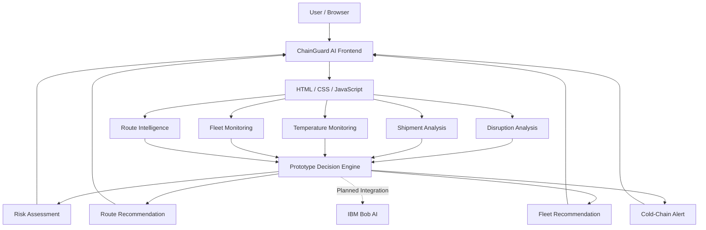

# Architecture

## System Architecture

ChainGuard AI is currently implemented as a lightweight web-based prototype. The system allows users to analyse supply-chain disruptions, evaluate shipment risk, monitor temperature-sensitive shipments, compare route options, and review fleet availability. The current prototype runs primarily in the browser using HTML, CSS and JavaScript with sample logistics data and an API-free route visualization layer.

## Components
| Component                  | Technology                    | Responsibility                                                                                                                            |
| -------------------------- | ----------------------------- | ----------------------------------------------------------------------------------------------------------------------------------------- |
| **Frontend**               | HTML5, CSS3, JavaScript       | Provides the dashboard, disruption analysis interface, shipment monitoring, route comparison, fleet monitoring, and cold-chain monitoring |
| **Disruption Analysis**    | JavaScript                    | Accepts origin, destination, disruption type, severity, shipment type, and operational information for analysis                           |
| **Shipment Analysis**      | JavaScript + Sample Data      | Evaluates shipment conditions and classifies operational risk                                                                             |
| **Temperature Monitoring** | JavaScript                    | Compares the current shipment temperature with the configured safe temperature range                                                      |
| **Route Intelligence**     | JavaScript + Custom Map UI    | Displays Route A, Route B, and Route C for prototype route comparison                                                                     |
| **Fleet Monitoring**       | JavaScript + Sample Data      | Displays available and in-transit fleet assets and supports prototype redeployment recommendations                                        |
| **Decision Engine**        | JavaScript                    | Combines disruption severity, temperature condition, route information, and fleet availability to generate prototype recommendations      |
| **AI Layer**               | IBM Bob — Planned             | Intended to provide deeper AI-based disruption analysis, reasoning, risk assessment, and operational recommendations                      |
| **Database**               | Not used in current prototype | Persistent shipment, fleet, sensor, and disruption data storage is planned for future implementation                                      |
| **Backend API**            | Not used in current prototype | A backend service can be added in a future version for centralized business logic and data management                                     |

## Data Flow

The current ChainGuard AI prototype follows the following data flow:

The user opens the ChainGuard AI web application in a browser.
The user selects an origin city and destination city from the available city list.
The user selects the type of supply-chain disruption, such as road blockage, heavy weather, vehicle breakdown, port strike, traffic congestion, or route closure.
The user selects the severity level of the disruption.
The user selects the shipment type, such as medicine, vaccine, food/perishable goods, or general cargo.
The user enters the current shipment temperature along with the minimum and maximum safe temperature limits.
The system checks whether the shipment temperature is inside the configured safe range.
The system analyses the disruption severity and shipment conditions using the current prototype decision logic.
The route intelligence module generates Route A, Route B, and Route C for prototype comparison.
Each route is presented with an estimated distance, estimated travel time, and operational risk level.
The recommendation engine selects a preferred route based on disruption severity and shipment conditions.
The fleet module checks the number of available trucks and provides a prototype fleet redeployment recommendation.
The cold-chain module generates a critical alert when the shipment temperature is outside the configured safe range.
The final analysis is displayed to the user through the ChainGuard AI dashboard.
In the planned final implementation, IBM Bob will be integrated into the analysis workflow to provide more advanced AI-based reasoning and recommendations.
